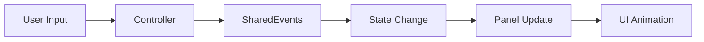

# NK Tools - Shared Core 🎮

[](https://unity3d.com/get-unity/download)
[](LICENSE)
[](package.json)

A **production-ready Unity package** providing essential game systems and clean MVC architecture for mobile game development. Build scalable games faster with battle-tested patterns and reusable components.

## ✨ Features

- 🏗️ **Clean MVC Architecture** - Structured base classes with standardized lifecycle
- 🎯 **State Management System** - Centralized game state handling with event-driven transitions  
- 🎨 **UI Panel Navigation** - Automatic panel switching with smooth DOTween animations
- 📡 **Type-Safe Event System** - Decoupled communication between systems
- 💾 **Centralized Data Store** - Global model repository with lazy initialization
- 📱 **Mobile-Optimized** - Safe area handling and touch-friendly interactions
- 🔧 **Singleton Utilities** - Thread-safe singleton pattern for MonoBehaviours
- 🚀 **Zero Configuration** - Works out of the box with sensible defaults

## 📦 Installation

### Via Package Manager (Recommended)

1. Open Unity Package Manager (`Window > Package Manager`)
2. Click the `+` button and select `Add package from git URL`
3. Enter: `https://github.com/nikunjkareliya/com.nktools.shared-core.git`

### Via manifest.json

Add this line to your project's `Packages/manifest.json`:

```json
{
  "dependencies": {
    "com.nktools.shared-core": "https://github.com/nikunjkareliya/com.nktools.shared-core.git"
  }
}
```

### Install Specific Version

To install a specific version, append the version tag to the git URL:

```json
{
  "dependencies": {
    "com.nktools.shared-core": "https://github.com/nikunjkareliya/com.nktools.shared-core.git#v1.0.0"
  }
}
```

**Available versions:**
- `#v1.0.0` - Latest stable release
- `#main` - Development branch (latest features)

## 🚀 Quick Start

### 1. Set Up Controllers

Create your game controller by inheriting from `BaseController`:

```csharp
using Shared.Core;

public class GameManager : BaseController
{
    protected override void Init()
    {
        // Initialize your game systems
        Debug.Log("Game Manager Initialized");
    }

    protected override void Register()
    {
        // Subscribe to events
        SharedEvents.OnGameStateChanged.Register(HandleStateChange);
    }

    protected override void Deregister()
    {
        // Unsubscribe from events
        SharedEvents.OnGameStateChanged.Unregister(HandleStateChange);
    }

    private void HandleStateChange(GameState newState)
    {
        Debug.Log($"Game state changed to: {newState}");
    }
}
```

### 2. Create UI Panels

Build your UI panels with automatic state management:

```csharp
using Shared.Core;

public class MenuPanel : BasePanel
{
    private void Awake()
    {
        State = GameState.Home; // Bind to game state
        SharedEvents.OnPanelRegistered.Execute(this);
    }

    protected override void OnShowCompleted()
    {
        Debug.Log("Menu panel is now visible");
        // Panel-specific logic here
    }

    public void OnPlayButtonClicked()
    {
        // Trigger state change - panel will automatically hide/show
        SharedEvents.OnGameStateChanged.Execute(GameState.Gameplay);
    }
}
```

### 3. Manage Game States

Control your game flow with the built-in state system:

```csharp
// Change game state from anywhere in your code
SharedEvents.OnGameStateChanged.Execute(GameState.LevelSelect);

// Access current state
var gameState = ModelStore.Get<GameStateModel>().CurrentState;

// Available states: Init, Home, LevelSelect, Gameplay, LevelCompleted, etc.
```

## 🏗️ Architecture Overview

### Core Systems

| System | Purpose | Key Components |
|--------|---------|----------------|
| **Base Classes** | Foundation architecture | `BaseController`, `BaseView`, `BaseViewController` |
| **State Management** | Game flow control | `GameState`, `GameStateController`, `GameStateModel` |
| **Event System** | Decoupled communication | `GameEvent<T>`, `SharedEvents` |
| **Panel Navigation** | UI management | `BasePanel`, `PanelNavigatorController` |
| **Data Store** | Centralized storage | `ModelStore` |
| **Utilities** | Helper components | `GenericSingleton<T>`, `SafeArea` |

### Event Flow



## 🎯 Key Benefits

### ⚡ **Rapid Development**
- Pre-built systems eliminate boilerplate code
- Standardized patterns accelerate team onboarding
- Focus on game logic instead of infrastructure

### 🔒 **Type Safety**
- Generic event system prevents runtime errors
- Compile-time validation for state transitions
- IntelliSense support for better developer experience

### 📈 **Scalability**
- Modular architecture supports large teams
- Clean separation of concerns
- Easy to extend and modify

### 🎨 **Smooth UX**
- Built-in DOTween animations
- Mobile-optimized interactions
- Safe area handling for modern devices

### 🧪 **Testability**
- Event-driven architecture enables easy mocking
- Clear lifecycle methods for unit testing
- Centralized state management

## 📋 Available Game States

```csharp
public enum GameState
{
    Init,           // Initial loading
    Home,           // Main menu
    LevelSelect,    // Level selection
    GameplayIntro,  // Pre-gameplay setup
    Gameplay,       // Active gameplay
    LevelFailed,    // Game over screen
    LevelCompleted, // Victory screen
    Shop,           // In-game store
    Settings,       // Settings panel
    Pause,          // Pause overlay
    // ... and more
}
```

## 🛠️ Dependencies

- **Unity 2022.3+** - Long Term Support version
- **DOTween** - Automatically installed via UPM for smooth animations
- **No external dependencies** - Self-contained package

## 📚 Examples

Check out the included demo scene at `Runtime/Scenes/SharedCoreDemo.unity` to see the framework in action.

### Sample Usage Patterns

**Trigger state changes:**
```csharp
SharedEvents.OnGameStateChanged.Execute(GameState.Gameplay);
```

**Listen to events:**
```csharp
SharedEvents.OnGameStateEntered.Register(OnGameplayStarted);
```

**Access shared data:**
```csharp
var playerData = ModelStore.Get<PlayerDataModel>();
```

**Create singleton services:**
```csharp
public class AudioManager : GenericSingleton<AudioManager>
{
    // Your audio management logic
}
```

## 📄 License

This project is licensed under the MIT License - see the [LICENSE](LICENSE) file for details.

## 🔗 Links

- [Repository](https://github.com/nikunjkareliya/com.nktools.shared-core)
- [Issues](https://github.com/nikunjkareliya/com.nktools.shared-core/issues)
- [Author](https://github.com/nikunjkareliya)
