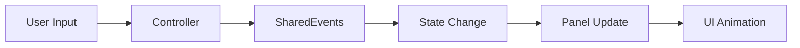

# NK Tools - Shared Core 🎮

[](https://unity3d.com/get-unity/download)
[](LICENSE)
[](package.json)

A **production-ready Unity package** providing essential game systems and clean MVC architecture for mobile game development. Build scalable games faster with battle-tested patterns and reusable components.

## ✨ Features

- 🏗️ **Clean MVC Architecture** - Structured base classes with standardized lifecycle
- 🎯 **State Management System** - Centralized game state handling with event-driven transitions
- 🎨 **UI Panel Navigation** - Automatic panel switching with smooth Unity coroutine animations
- 🖼️ **UI Setup Wizard** - Visual editor tool to generate and manage MainUI prefabs with panel navigation system
- 🎬 **Scene Switcher** - Quick scene navigation tool for Build Settings scenes with one-click switching
- 📡 **Type-Safe Event System** - Decoupled communication with weak reference support and memory leak prevention
- 💾 **Centralized Data Store** - Global model repository with lazy initialization
- 📱 **Mobile-Optimized** - Safe area handling and touch-friendly interactions
- 🔧 **Singleton Utilities** - Thread-safe singleton pattern for MonoBehaviours
- 🐛 **Debugging Tools** - Built-in debugging and profiling for event system
- 🚀 **Zero Configuration** - Works out of the box with sensible defaults

## 📦 Installation

### Via Package Manager (Recommended)

1. Open Unity Package Manager (`Window > Package Manager`)
2. Click the `+` button and select `Add package from git URL`
3. Enter: `https://github.com/nikunjkareliya/com.nktools.shared-core.git`

### Via manifest.json

Add this line to your project's `Packages/manifest.json`:

```json
{
  "dependencies": {
    "com.nktools.shared-core": "https://github.com/nikunjkareliya/com.nktools.shared-core.git"
  }
}
```

### Install Specific Version

To install a specific version, append the version tag to the git URL:

```json
{
  "dependencies": {
    "com.nktools.shared-core": "https://github.com/nikunjkareliya/com.nktools.shared-core.git#v1.0.0"
  }
}
```

**Available versions:**
- `#v1.4.1` - UI Setup Wizard overlay support
- `#v1.3.1` - Latest stable release (Scene Switcher, UI Setup Wizard)
- `#v1.3.0` - UI Setup Wizard, Editor assembly definition
- `#v1.2.1` - Improved event naming consistency, added Loading state
- `#v1.2.0` - Zero dependencies, improved reliability
- `#v1.1.0` - GameEvent improvements
- `#v1.0.0` - Initial stable release
- `#main` - Development branch (latest features)

## 🚀 Quick Start

### 1. Set Up Controllers

Create your game controller by inheriting from `BaseController`:

```csharp
using Shared.Core;

public class GameManager : BaseController
{
    protected override void Init()
    {
        // Initialize your game systems
        Debug.Log("Game Manager Initialized");
    }

    protected override void Register()
    {
        // Subscribe to events
        SharedEvents.GameStateChanged.Register(HandleGameStateChanged);
    }

    protected override void Deregister()
    {
        // Unsubscribe from events
        SharedEvents.GameStateChanged.Unregister(HandleGameStateChanged);
    }

    private void HandleGameStateChanged(GameState newState)
    {
        Debug.Log($"Game state changed to: {newState}");
    }
}
```

### 2. Create UI Panels

Build your UI panels with automatic state management:

```csharp
using Shared.Core;

public class MenuPanel : BasePanel
{
    private void Awake()
    {
        State = GameState.Home; // Bind to game state
        SharedEvents.PanelRegistered.Execute(this);
    }

    protected override void OnShowCompleted()
    {
        Debug.Log("Menu panel is now visible");
        // Panel-specific logic here
    }

    public void OnPlayButtonClicked()
    {
        // Trigger state change - panel will automatically hide/show
        SharedEvents.GameStateChanged.Execute(GameState.Gameplay);
    }
}
```

### 3. Manage Game States

Control your game flow with the built-in state system:

```csharp
// Change game state from anywhere in your code
SharedEvents.GameStateChanged.Execute(GameState.LevelSelect);

// Access current state
var gameState = ModelStore.Get<GameStateModel>().CurrentState;

// Available states: Init, Home, LevelSelect, Gameplay, LevelCompleted, etc.
```

## 🎨 UI Setup Wizard (v1.3.0)

Generate production-ready MainUI prefabs with a visual editor tool.

**Access:** `Tools > NK Tools > UI Setup Wizard`

### Key Features
- **Aspect Ratio Presets** - Portrait (9:16, 9:20, 3:4) and Landscape (16:9, 20:9, 4:3)
- **Dynamic Panels** - Add built-in panels (Home, Gameplay, etc.) or custom panel scripts
- **Overlay Panels** - Configure panels as overlays (popups) to appear on top of other screens
- **Safe Updates** - Modify existing prefabs without losing manual changes
- **Sync Mode** - Keep prefabs perfectly synced with wizard configuration
- **Preset System** - Save/load configurations for different platforms

### Quick Usage
1. Open: `Tools > NK Tools > UI Setup Wizard`
2. Select aspect ratio (Portrait/Landscape/Custom)
3. Configure panels (built-in or custom)
4. Click "Generate Prefab"
5. MainUI prefab created at `Assets/Prefabs/UI/MainUIPrefab.prefab`

**📖 Full Documentation:** See `Editor/Documentation/UISetupWizard_README.md` for complete guide with workflows, troubleshooting, and best practices.

## 🎬 Scene Switcher

Quick scene navigation editor tool for Build Settings scenes.

**Access:** `Tools > NK Tools > Scene Switcher`

### Features
- **Scrollable Scene List** - View all scenes from Build Settings
- **One-Click Switching** - Instantly switch to any scene in your build
- **Safe Scene Loading** - Prompts to save unsaved changes before switching
- **Scene Indexing** - Shows scene index and name for easy reference

### Quick Usage
1. Open: `Tools > NK Tools > Scene Switcher`
2. Select any scene from the scrollable list
3. Scene switches automatically (with save prompt if needed)

## 🎯 GameEvent System (v1.1.0)

The enhanced event system provides enterprise-grade features for production Unity applications:

### ✨ New Features

- **🔄 Weak Reference Support** - Automatic cleanup of destroyed Unity objects
- **🧹 Memory Leak Prevention** - No more memory leaks from unregistered listeners
- **🐛 Debugging Tools** - Built-in debugging and profiling capabilities
- **📊 Listener Inspection** - View all registered listeners in Unity Inspector
- **🛡️ Thread Safety** - Production-ready thread-safe implementation
- **📝 Detailed Error Context** - Rich error messages with listener information

### 🔧 Usage Examples

```csharp
// Register a listener (automatically handles Unity object lifecycle)
SharedEvents.GameStateChanged.Register(HandleGameStateChanged);

// Check if listener is registered
if (SharedEvents.GameStateChanged.IsRegistered(HandleGameStateChanged))
{
    Debug.Log("Listener is registered");
}

// Get listener count
int count = SharedEvents.GameStateChanged.ListenerCount;

// Debug information (Unity Editor only)
#if UNITY_EDITOR
string debugInfo = SharedEvents.GameStateChanged.GetDebugInfo();
string[] listenerInfo = SharedEvents.GameStateChanged.GetListenerInfo();
#endif
```

### 🧹 Automatic Cleanup

The system automatically cleans up destroyed Unity objects:
- **GameObjects** - Automatically unregistered when destroyed
- **Components** - Automatically unregistered when destroyed
- **Static Methods** - No cleanup needed (persistent)

## 🏗️ Architecture Overview

### Core Systems

| System | Purpose | Key Components |
|--------|---------|----------------|
| **Base Classes** | Foundation architecture | `BaseController`, `BaseView`, `BaseViewController` |
| **State Management** | Game flow control | `GameState`, `GameStateController`, `GameStateModel` |
| **Event System** | Decoupled communication | `GameEvent<T>`, `SharedEvents` |
| **Panel Navigation** | UI management | `BasePanel`, `PanelNavigatorController` |
| **Data Store** | Centralized storage | `ModelStore` |
| **Utilities** | Helper components | `GenericSingleton<T>`, `SafeArea` |

### Event Flow



## 🎯 Key Benefits

### ⚡ **Rapid Development**
- Pre-built systems eliminate boilerplate code
- Standardized patterns accelerate team onboarding
- Focus on game logic instead of infrastructure

### 🔒 **Type Safety**
- Generic event system prevents runtime errors
- Compile-time validation for state transitions
- IntelliSense support for better developer experience

### 📈 **Scalability**
- Modular architecture supports large teams
- Clean separation of concerns
- Easy to extend and modify

### 🎨 **Smooth UX**
- Built-in Unity coroutine animations
- Mobile-optimized interactions
- Safe area handling for modern devices

### 🧪 **Testability**
- Event-driven architecture enables easy mocking
- Clear lifecycle methods for unit testing
- Centralized state management

## 📋 Available Game States

```csharp
public enum GameState
{
    Init,           // Initial loading
    Home,           // Main menu
    LevelSelect,    // Level selection
    GameplayIntro,  // Pre-gameplay setup
    Gameplay,       // Active gameplay
    LevelFailed,    // Game over screen
    LevelCompleted, // Victory screen
    Shop,           // In-game store
    Settings,       // Settings panel
    Pause,          // Pause overlay
    // ... and more
}
```

## 🛠️ Dependencies

- **Unity 2022.3+** - Long Term Support version
- **Zero external dependencies** - Completely self-contained package
- **Unity Coroutines** - Built-in animation system for smooth transitions

## 📚 Examples

Check out the included demo scene at `Runtime/Scenes/SharedCoreDemo.unity` to see the framework in action.

### Sample Usage Patterns

**Trigger state changes:**
```csharp
SharedEvents.GameStateChanged.Execute(GameState.Gameplay);
```

**Listen to events:**
```csharp
SharedEvents.OnGameStateEntered.Register(OnGameplayStarted);
```

**Access shared data:**
```csharp
var playerData = ModelStore.Get<PlayerDataModel>();
```

**Create singleton services:**
```csharp
public class AudioManager : GenericSingleton<AudioManager>
{
    // Your audio management logic
}
```

## 📋 Changelog

### v1.4.1 - UI Setup Wizard Enhancements
- 🖼️ **Overlay Panel Support** - Configure panels as overlays directly in the UI Setup Wizard
- 🛠️ **Wizard UI Updates** - Added toggle for overlay configuration in panel list
- ⚡ **Workflow Improvement** - No need to manually configure overlay settings in inspector

### v1.3.1 - Scene Switcher Tool
- 🎬 **Scene Switcher** - Quick scene navigation editor window
- 📂 **Build Settings Integration** - One-click switching between all scenes in build
- 💾 **Safe Scene Loading** - Automatic save prompts before switching
- 📋 **Scene Indexing** - View scene index and name in scrollable list

### v1.3.0 - UI Setup Wizard & Editor Tools
- 🎨 **UI Setup Wizard** - Visual editor tool for MainUI prefab generation
- 📦 **Editor Assembly Definition** - Proper package structure with Shared.Core.Editor.asmdef
- 🖼️ **Aspect Ratio Presets** - Portrait, Landscape, and Custom resolution support
- ⚙️ **Dynamic Panel Management** - Add, update, and remove panels visually
- 🔒 **Safe Update Mode** - Modify prefabs without data loss
- 🔄 **Sync Mode** - Perfect prefab synchronization with wizard
- 💾 **Preset System** - Save/load configurations as JSON
- 📚 **Comprehensive Documentation** - Full wizard guide in Editor/Documentation/

### v1.2.1 - Event Naming & Loading State
- ✏️ **Renamed GameEvents** to follow revised global event naming rules (removed `On` prefixes)
- 🧭 **Added `Loading` game state** between `Init` and `Home` for clearer flow control
- 🧾 **Updated SharedEvents API docs** to reflect new handler naming (`HandleGameStateChanged` etc.)
- 📄 **Refreshed README** with updated examples and version badge

### v1.2.0 - Zero Dependencies & Reliability Improvements
- 🚀 **Removed DOTween dependency** - Replaced with Unity coroutines for zero external dependencies
- 🔧 **Fixed compilation errors** - Resolved CS0066 event declaration error in GameEvent.cs
- 📁 **Added missing meta files** - Fixed Unity import warnings
- 🔑 **Resolved GUID conflicts** - Updated asset GUIDs to prevent conflicts
- ✨ **Improved reliability** - Completely self-contained package with no external dependencies
- 🎨 **Maintained animation quality** - Smooth fade transitions using Unity's built-in coroutines
- 📚 **Updated documentation** - Comprehensive changelog and version tracking

### v1.1.0 - GameEvent System Enhancement
- ✨ **Added weak reference support** for Unity Components and GameObjects
- 🧹 **Automatic memory cleanup** of destroyed Unity objects
- 🐛 **Built-in debugging tools** for event system inspection
- 📊 **Listener inspection** capabilities in Unity Editor
- 🛡️ **Enhanced thread safety** with listener snapshots
- 📝 **Detailed error context** with listener information
- 🔍 **IsRegistered() method** to check listener registration status
- 📈 **Performance monitoring** with execution and exception counters

### v1.0.0 - Initial Release
- Core MVC architecture
- State management system
- UI panel navigation
- Basic event system
- Singleton utilities

## 📄 License

This project is licensed under the MIT License - see the [LICENSE](LICENSE) file for details.

## 🔗 Links

- [Repository](https://github.com/nikunjkareliya/com.nktools.shared-core)
- [Issues](https://github.com/nikunjkareliya/com.nktools.shared-core/issues)
- [Author](https://github.com/nikunjkareliya)
